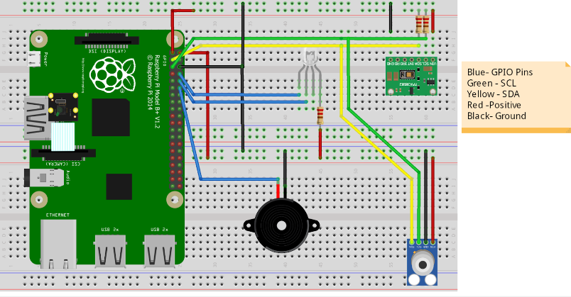
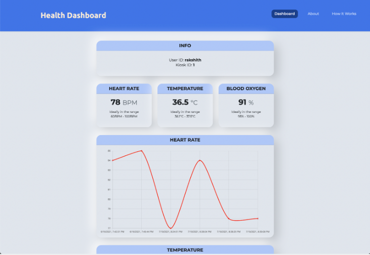
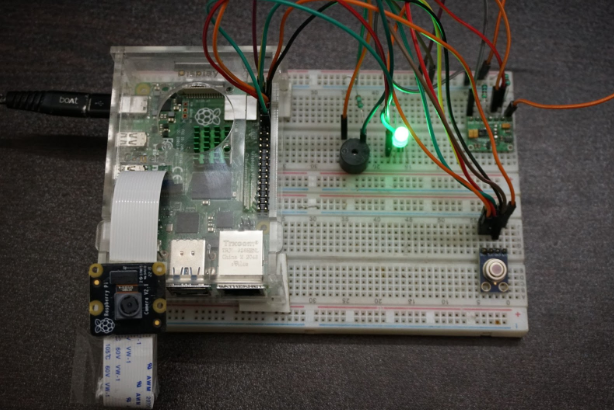

# Scalable Vitals Monitoring System

  * Python based application for Raspbbery Pi to authenticate a person via QR-Code, record vitals the vitals, publish the data to a remote InfluxDB database and Visualize it in a dashboard.

## Circuit Diagram

## Front End Dashboard

## Hardware
